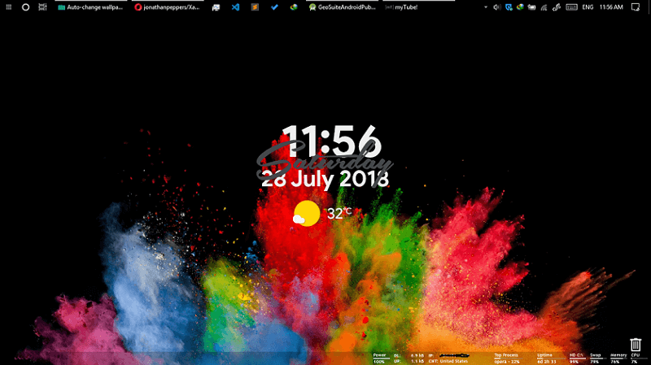

# awesome-rainmeter
 

> List of [Rainmeter](https://www.rainmeter.net/) widgets and plugins

## Contents

- [Widgets](#widgets)
- [Plugins](#plugins)

## Widgets

## Plugins

## Contribute

Contributions welcome! Read the [contribution guidelines](contributing.md) first.

## License

To the extent possible under law, Shahriar Yazdipour has waived all copyright and
related or neighboring rights to this work.
